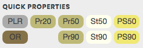

# WME E95
User script for Waze Map Editor.  
Create an additional panel with buttons for set up a set of road properties in one click.

Ukrainian manual: https://wazeopedia.waze.com/wiki/Ukraine/Scripts/WME_E95

### Default settings

<table style="width:100%">
<tr>
  <th>Button</th>
  <th>Shortcut</th>
  <th>Type</th>
  <th>Speed</th>
  <th>City</th>
  <th>Lock</th>
</tr>
<tr>
<td align='center'><strong>PR 5</strong></td>
<td align='center'><code>Alt</code>+<code>1</code></td>
<td align='center'>private</td>
<td align='center'>5 km/h</td>
<td align='center'>auto</td>
<td align='center'>1</td>
</tr>
<tr>
<td align='center'><strong>PR20</strong></td>
<td align='center'><code>Alt</code>+<code>2</code></td>
<td align='center'>private</td>
<td align='center'>20 km/h</td>
<td align='center'>auto</td>
<td align='center'>1</td>
</tr>
<tr>
<td align='center'><strong>PR50</strong></td>
<td align='center'><code>Alt</code>+<code>3</code></td>
<td align='center'>private</td>
<td align='center'>50 km/h</td>
<td align='center'>auto</td>
<td align='center'>1</td>
</tr>
<tr>
<td align='center'><strong>St50</strong></td>
<td align='center'><code>Alt</code>+<code>4</code></td>
<td align='center'>street</td>
<td align='center'>50 km/h</td>
<td align='center'>auto</td>
<td align='center'>1</td>
</tr>
<tr>
<td align='center'><strong>PS50</strong></td>
<td align='center'><code>Alt</code>+<code>5</code></td>
<td align='center'>primary</td>
<td align='center'>50 km/h</td>
<td align='center'>auto</td>
<td align='center'>2</td>
</tr>
<tr>
<td align='center'><strong>PLR</strong></td>
<td align='center'><code>Alt</code>+<code>6</code></td>
<td align='center'>parking</td>
<td align='center'>5 km/h</td>
<td align='center'>auto</td>
<td align='center'>1</td>
</tr>
<tr>
<td align='center'><strong>OR</strong></td>
<td align='center'><code>Alt</code>+<code>7</code></td>
<td align='center'>off-road</td>
<td align='center'>90 km/h</td>
<td align='center'>clear</td>
<td align='center'>1</td>
</tr>
<tr>
<td align='center'><strong>PR90</strong></td>
<td align='center'><code>Alt</code>+<code>8</code></td>
<td align='center'>private</td>
<td align='center'>90 km/h</td>
<td align='center'>clear</td>
<td align='center'>1</td>
</tr>
<tr>
<td align='center'><strong>St90</strong></td>
<td align='center'><code>Alt</code>+<code>9</code></td>
<td align='center'>street</td>
<td align='center'>90 km/h</td>
<td align='center'>clear</td>
<td align='center'>1</td>
</tr>
<tr>
<td align='center'><strong>PS90</strong></td>
<td align='center'><code>Alt</code>+<code>0</code></td>
<td align='center'>primary</td>
<td align='center'>90 km/h</td>
<td align='center'>clear</td>
<td align='center'>2</td>
</tr>
</table>

### Ukraine
* For roads outside the city set highlight requirements flag

## Links

Author homepage: https://anton.shevchuk.name/  
Author pet projects: https://hohli.com/  
Support author: https://donate.hohli.com/  
Script homepage: https://github.com/AntonShevchuk/wme-e95/  
GreasyFork: https://greasyfork.org/uk/scripts/382614-wme-e95  
