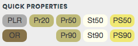

# WME 🇺🇦 E95
User script for Waze Map Editor.
Create an additional panel with buttons for set up a set of road properties in one click.



Ukrainian manual: https://wazeopedia.waze.com/wiki/Ukraine/Scripts/WME_E95

## Development

### Install & Build

```bash
npm install
npm run build       # one-off build → dist/WME-E95.user.js
npm run watch       # rebuild on changes
```

### Project Structure

Source is written in TypeScript under `src/`, built with Rollup into a single IIFE at `dist/WME-E95.user.js`.

```
src/
├── meta.ts              # userscript header (comment block)
├── style.css            # plain CSS
├── globals.d.ts         # WME runtime globals
├── types.ts             # road types, colors, TS interfaces
├── translations.ts      # i18n (en, uk, ru)
├── layers.ts            # speed limit / headlights layers
├── buttons/
│   ├── index.ts         # default buttons (A-L), country registry
│   └── countries/       # per-country overrides
├── e95.ts               # E95 class
└── index.ts             # bootstrap entry point
```

### Adding a New Country

1. Find the country's numeric ID in the Waze Map Editor (visible in the WME SDK or URL when editing in that country).

2. Create a new file `src/buttons/countries/<country>.ts`:

```ts
import { CountryConfig, TYPES } from '../../types'

const example: CountryConfig = {
  id: 123,           // Waze country ID
  name: 'example',   // lowercase, used as key
  buttons: {
    // Override existing buttons (A-L) — partial overrides are OK,
    // missing fields are inherited from defaults via deep merge
    D: {
      title: 'St60',
      attributes: {
        fwdSpeedLimit: 60,
        revSpeedLimit: 60,
        roadType: TYPES.street,
        lockRank: 1,
      },
    },
    // Set a button to false to disable it
    G: false,
    // Add extra buttons beyond A-L
    M: {
      title: 'FW120',
      attributes: {
        fwdSpeedLimit: 120,
        revSpeedLimit: 120,
        roadType: TYPES.freeway,
        lockRank: 4,
      },
    },
  },
}

export default example
```

3. Import and register it in `src/buttons/index.ts`:

```ts
import example from './countries/example'

const countries: CountryConfig[] = [
  albania, greece, honduras, hungary, portugal, ukraine, example,
]
```

4. Build and verify: `npm run build`

#### Button Config Reference

| Field | Type | Description |
|-------|------|-------------|
| `title` | `string` | Button label (e.g., `'St50'`) |
| `shortcut` | `string \| null` | Keyboard shortcut (e.g., `'A+1'` for Alt+1) |
| `options.detectCity` | `boolean` | Auto-detect city from neighboring segments |
| `options.clearCity` | `boolean` | Clear city and street |
| `attributes.fwdSpeedLimit` | `number` | Forward speed limit (km/h) |
| `attributes.revSpeedLimit` | `number` | Reverse speed limit (km/h) |
| `attributes.roadType` | `number` | Use `TYPES.*` constants (e.g., `TYPES.street`) |
| `attributes.lockRank` | `number` | Lock level 0-4 (capped to user's rank at runtime) |
| `attributes.flagAttributes` | `object` | Flags like `{ headlights: true, unpaved: true }` |

Available road types: `street`, `primary`, `freeway`, `ramp`, `trail`, `major`, `minor`, `offroad`, `walkway`, `boardwalk`, `ferry`, `stairway`, `private`, `railroad`, `runway`, `parking`, `narrow`.

## Default settings

<table style="width:100%">
<tr>
  <th>Button</th>
  <th>Shortcut</th>
  <th>Type</th>
  <th>Speed</th>
  <th>City</th>
  <th>Lock</th>
</tr>
<tr>
<td align='center'><strong>PR 5</strong></td>
<td align='center'><code>Alt</code>+<code>1</code></td>
<td align='center'>private</td>
<td align='center'>5 km/h</td>
<td align='center'>auto</td>
<td align='center'>1</td>
</tr>
<tr>
<td align='center'><strong>PR20</strong></td>
<td align='center'><code>Alt</code>+<code>2</code></td>
<td align='center'>private</td>
<td align='center'>20 km/h</td>
<td align='center'>auto</td>
<td align='center'>1</td>
</tr>
<tr>
<td align='center'><strong>PR50</strong></td>
<td align='center'><code>Alt</code>+<code>3</code></td>
<td align='center'>private</td>
<td align='center'>50 km/h</td>
<td align='center'>auto</td>
<td align='center'>1</td>
</tr>
<tr>
<td align='center'><strong>St50</strong></td>
<td align='center'><code>Alt</code>+<code>4</code></td>
<td align='center'>street</td>
<td align='center'>50 km/h</td>
<td align='center'>auto</td>
<td align='center'>1</td>
</tr>
<tr>
<td align='center'><strong>PS50</strong></td>
<td align='center'><code>Alt</code>+<code>5</code></td>
<td align='center'>primary</td>
<td align='center'>50 km/h</td>
<td align='center'>auto</td>
<td align='center'>2</td>
</tr>
<tr>
<td align='center'><strong>mH50</strong></td>
<td align='center'><code>None</code></td>
<td align='center'>minor highway</td>
<td align='center'>50 km/h</td>
<td align='center'>auto</td>
<td align='center'>3</td>
</tr>
<tr>
<td align='center'><strong>PLR</strong></td>
<td align='center'><code>Alt</code>+<code>6</code></td>
<td align='center'>parking</td>
<td align='center'>5 km/h</td>
<td align='center'>auto</td>
<td align='center'>1</td>
</tr>
<tr>
<td align='center'><strong>OR</strong></td>
<td align='center'><code>Alt</code>+<code>7</code></td>
<td align='center'>off-road</td>
<td align='center'>90 km/h</td>
<td align='center'>none</td>
<td align='center'>1</td>
</tr>
<tr>
<td align='center'><strong>PR90</strong></td>
<td align='center'><code>Alt</code>+<code>8</code></td>
<td align='center'>private</td>
<td align='center'>90 km/h</td>
<td align='center'>none</td>
<td align='center'>1</td>
</tr>
<tr>
<td align='center'><strong>St90</strong></td>
<td align='center'><code>Alt</code>+<code>9</code></td>
<td align='center'>street</td>
<td align='center'>90 km/h</td>
<td align='center'>none</td>
<td align='center'>1</td>
</tr>
<tr>
<td align='center'><strong>PS90</strong></td>
<td align='center'><code>Alt</code>+<code>0</code></td>
<td align='center'>primary</td>
<td align='center'>90 km/h</td>
<td align='center'>clear</td>
<td align='center'>2</td>
</tr>
<tr>
<td align='center'><strong>mH90</strong></td>
<td align='center'><code>None</code></td>
<td align='center'>minor highway</td>
<td align='center'>90 km/h</td>
<td align='center'>clear</td>
<td align='center'>3</td>
</tr>
</table>

## Country Configurations

The script automatically detects the country from the map and applies country-specific button overrides. Countries override the default button layout — unspecified buttons inherit default settings via deep merge.

### Albania 🇦🇱

Full button layout replacement with local speed limits:

| | A | B | C | D | E | F |
|---|---|---|---|---|---|---|
| **Button** | PLR | Pr40 | St40 | PS40 | mH40 | MH40 |
| **Type** | parking | private | street | primary | minor | major |
| **Speed** | 5 | 40 | 40 | 40 | 40 | 40 |

| | G | H | I | J | K | L |
|---|---|---|---|---|---|---|
| **Button** | FW90 | Pr80 | St80 | PS80 | mH80 | MH80 |
| **Type** | freeway | private | street | primary | minor | major |
| **Speed** | 90 | 80 | 80 | 80 | 80 | 80 |

### Greece 🇬🇷

Overrides D-F and J-L, adds extra buttons M-P:

| | D | E | F | J | K | L |
|---|---|---|---|---|---|---|
| **Button** | ST30 | ST50 | ST90 | PR30 | PR50 | PR90 |
| **Type** | street | street | street | primary | primary | primary |
| **Speed** | 30 | 50 | 90 | 30 | 50 | 90 |

Extra buttons: **M** (private), **N** (unpaved street), **O** (unpaved street 40), **P** (street)

### Honduras 🇭🇳

Uses only 6 buttons (G-L disabled), all with auto city detection:

| | A | B | C | D | E | F |
|---|---|---|---|---|---|---|
| **Button** | PR | PLR | StU | StP | PSU | PSP |
| **Type** | private | parking | street | street | primary | primary |
| **Speed** | 20 | 20 | 40 | 40 | 40 | 40 |
| **Flags** | | | unpaved | | unpaved | |

### Hungary 🇭🇺

Minimal overrides — only adjusts speed limits on buttons A, B, G:

| | A | B | G |
|---|---|---|---|
| **Button** | PR20 | PR30 | PLR |
| **Speed** | 20 | 30 | 20 |

### Portugal 🇵🇹

Minimal overrides — adjusts speed limits on buttons G, H:

| | G | H |
|---|---|---|
| **Button** | PLR | OR |
| **Speed** | 30 | 30 |

### Ukraine 🇺🇦

Overrides buttons H-L to add the **headlights** flag for roads outside cities:

| | H | I | J | K | L |
|---|---|---|---|---|---|
| **Button** | OR | PR90 | St90 | PS90 | mH90 |
| **Headlights** | yes | yes | yes | yes | yes |
| **Clear city** | yes | — | — | — | — |

## Links

Author homepage: https://anton.shevchuk.name/  
Author pet projects: https://hohli.com/  
Support author: https://donate.hohli.com/  
Script homepage: https://github.com/AntonShevchuk/wme-e95/  
GreasyFork: https://greasyfork.org/uk/scripts/382614-wme-e95  
